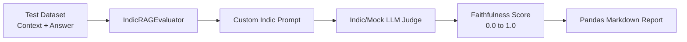

<div align="center">
  
# 🇮🇳 Indic LLM RAG Evaluator

**Robust, faithful evaluation of Retrieval-Augmented Generation for Hindi & Hinglish context.**

[](https://python.org)
[](https://docker.com)
[](https://langchain.com)
[](https://pandas.pydata.org)
[](https://opensource.org/licenses/MIT)

</div>

<br/>

## 📖 Overview

The **Indic LLM RAG Evaluator** is an enterprise-ready testing and validation framework designed specifically for Indic languages. It assesses the *faithfulness* and *accuracy* of responses generated by RAG (Retrieval-Augmented Generation) pipelines, ensuring that your Hindi and Hinglish LLM models rely firmly on the provided context rather than hallucinating.

---

## 🏗️ Architecture



1. **Dataset Ingestion**: Takes in dictionaries comprising `question`, `context`, and the generated `answer`.
2. **Evaluator Engine**: The `IndicRAGEvaluator` uses customized LangChain prompt templates optimized for Hindi/Hinglish instructions.
3. **LLM Judge**: Leverages a scoring LLM (e.g., Sarvam AI, OpenAI, or a local mock) to rigorously check answer faithfulness.
4. **Reporting**: Generates easy-to-read batch reports using Pandas and Markdown.

---

## 🚀 Quick Start

### Prerequisites
- [Docker](https://docs.docker.com/get-docker/) & [Docker Compose](https://docs.docker.com/compose/install/) (Recommended)
- OR Python 3.10+ installed locally.

### 🐳 Run via Docker (Recommended)

Get up and running in seconds with a fully containerized environment!

1. **Clone the repository** (if you haven't already):
   ```bash
   git clone https://github.com/your-username/indic-llm-rag-evaluator.git
   cd indic-llm-rag-evaluator
   ```

2. **Run with Docker Compose**:
   ```bash
   docker-compose up --build
   ```

You will see the evaluation pipeline run and print out the tabulated results directly in your terminal.

### 💻 Run via Local Python

1. **Install dependencies**:
   ```bash
   pip install -r requirements.txt
   ```

2. **Execute the evaluator**:
   ```bash
   python evaluator.py
   ```

---

## 🛠️ Usage Example

You can integrate `IndicRAGEvaluator` in your own scripts:

```python
from evaluator import IndicRAGEvaluator

test_data = [
    {
        "question": "Sarvam AI kya banata hai?",
        "context": "Sarvam AI is building full-stack AI for India...",
        "answer": "Sarvam AI भारत के लिए फुल-स्टैक AI बना रहा है..."
    }
]

evaluator = IndicRAGEvaluator()
results = evaluator.evaluate_batch(test_data)

print(results.to_markdown(index=False))
```

---

## 🤝 Contributing

We welcome pull requests! For major changes, please open an issue first to discuss what you would like to change. 

<div align="center">
  Made with ❤️ for the Indic AI Ecosystem.
</div>
